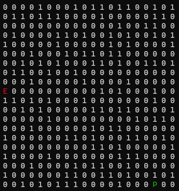
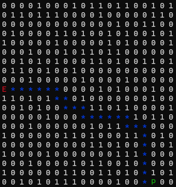

# Maze Path Validator

## Introduction

This program is a Maze Validator that allows users to interactively or automatically solve randomly generated mazes. It serves as an educational tool for understanding pathfinding algorithms like A* and provides a fun way to explore solving mazes of varying sizes.

---

## Features

- **Interactive Mode**: Users can navigate through the maze using `W`, `A`, `S`, `D` keys to reach the endpoint.
- **Automated Solver**: The program uses the A* algorithm to find the shortest path from the start to the end.
- **Random Maze Generation**: Mazes are randomly generated with walls and paths, ensuring every maze is solvable.
- **Dynamic Dimensions**: Users can customize maze dimensions up to a maximum of `20x20`.
- **Color-Coded Output**:
  - **Start**: Green (`P`)
  - **End**: Red (`E`)
  - **Path**: Blue (`*`)

---

## Code Structure

- **`printMaze`**: Displays the maze in the terminal, with colors highlighting the player, endpoint, and path.
- **`generateMaze`**: Generates a random maze, ensuring solvability using the A* algorithm.
- **`solveMazeAStar`**: Implements the A* pathfinding algorithm to solve the maze.
- **`validatePath`**: Allows users to solve the maze manually.
- **`solveMazeForValidation`**: Validates if a randomly generated maze has a valid path from the start (`P`) to the end (`E`) using the A* algorithm. If no valid path exists, the maze is regenerated until solvable.
- **`main`**: Displays the main menu and manages user interaction.

---

## Usage Instructions

1. Compile and run the program in your C++ IDE or terminal.
2. Follow the menu options:
   - **Option 1**: Generate a new maze.
   - **Option 2**: Adjust maze dimensions.
   - **Option 3**: Solve the maze manually.
   - **Option 4**: Automatically solve the maze using A*.
   - **Option 5**: Exit the program.
3. In manual mode, use:
   - **W**: Move up
   - **A**: Move left
   - **S**: Move down
   - **D**: Move right
   - **Q**: Quit manual solving.

---

## A* Algorithm Explanation

The A* algorithm is an informed search algorithm that combines:
- **g**: The cost of reaching a node from the start.
- **h**: The heuristic estimate to the endpoint (Manhattan distance).

The algorithm selects the node with the lowest `f = g + h` value, ensuring it finds the shortest path efficiently.

---

## Example Outputs

### Generated Maze:

### Maze Solved Automatically Using A* Algorithm:

---

## Conclusion

This program demonstrates the practical application of the A* algorithm in pathfinding and teaches basic problem-solving skills. It’s a fun way to experiment with algorithms and develop programming skills.
